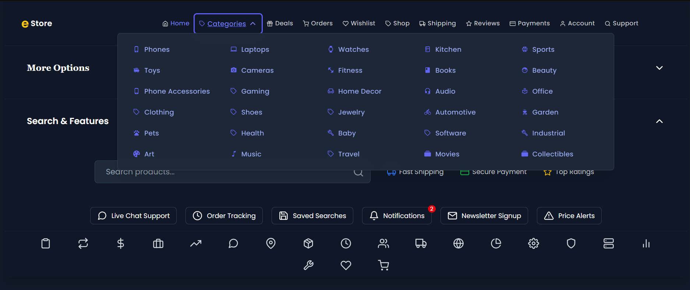
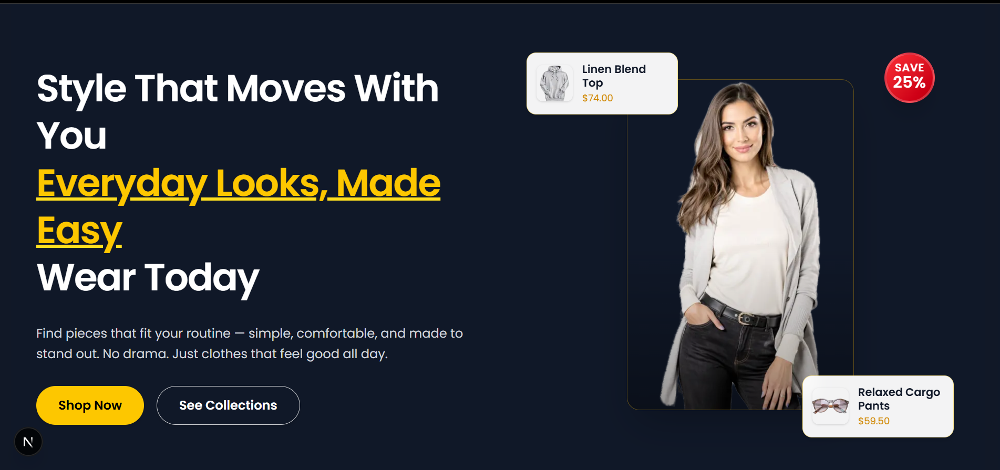
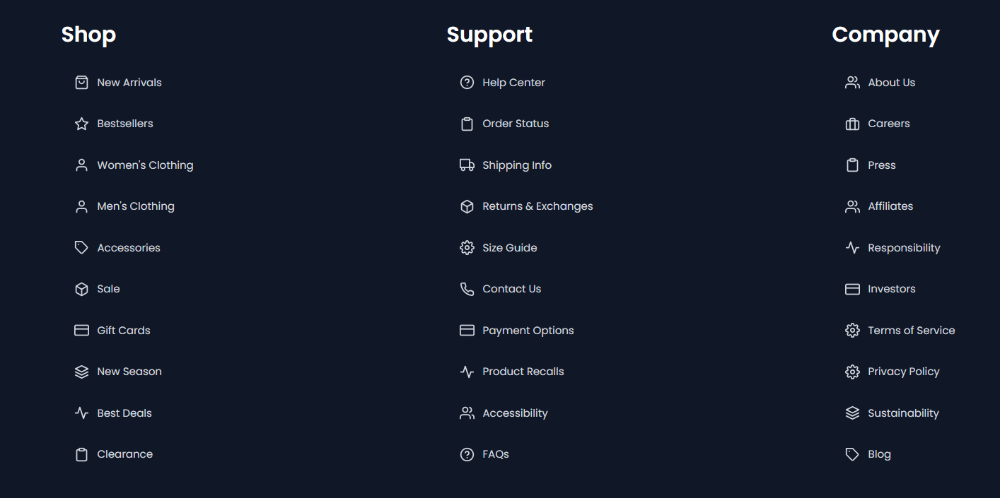

# eStore Ecommerce

**eStore Ecommerce** is my first complete eCommerce UI project.  
I built it while learning how modern front-end development works.

This project was developed with **Next.js (JavaScript)**.  
It’s a large project, and I completed it in about **2 months**.

## Screenshots

### Header

### Home View

### Footer

## What I learned from this project

- Building real eCommerce pages and layouts
- Creating reusable UI components
- Routing and page structure in Next.js
- Working with dynamic UI patterns (cards, grids, sections)
- Improving responsiveness for mobile and desktop
- Writing cleaner code and organizing folders for a big project

## Tech Stack

- **Next.js**
- **JavaScript**
- **React**
- **CSS / Tailwind (if used)**

## Status

✅ Completed (2-month build)

## Note

This project represents my starting point in front-end development.  
It helped me understand practical UI building and how large projects are structured.
